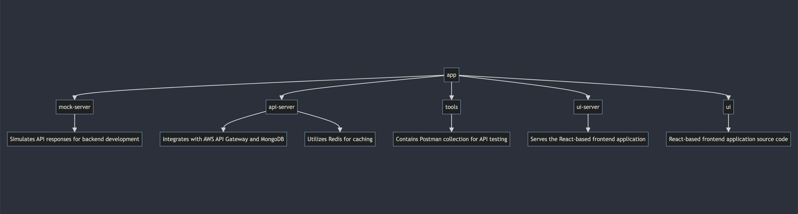

# Secure The Task

👋 Hi, welcome, and thanks for coming along!

## Notice
 I have kept an exstensive Devlog in [Notion](https://www.notion.so/) with all of my notes, thoughts, decision making and more. (There may be a need to sign-up.)

**[Read the Devlog 👀](https://perfect-rhodium-442.notion.site/THM-Devlog-Secure-the-Task-38c19eebba3c468986b4f93344015686)**

## API
To maintain a single source of truth, please visit Notion:

**[Read the API Docs](https://perfect-rhodium-442.notion.site/API-Design-dc3b9f79e37f43688783c9ba0322502b)**


## Quick Workspace Overview
Secure the task is a monorepo with [workspaces](https://docs.npmjs.com/cli/v7/using-npm/workspaces)



## Installation
### Prerequisites
- [Node.js](https://nodejs.org/en): Install the latest LTS version of Node.js from the official website. Node.js is the runtime environment required to run JavaScript (and by extension, TypeScript) code outside the browser.
- [npm](https://www.npmjs.com/) (Node Package Manager): Comes bundled with Node.js. It's used to manage Node.js packages, I am using the public registry at this time but should be changed in future.
- [brew](https://brew.sh/): as this repository only supports macos dev at this time, it is likely that you already have brew.
- [mkcert](https://formulae.brew.sh/formula/mkcert#default): `brew install mkcert` we need this for making a TLS Certificate and Private Key. For HTTPS, you will need a TLS certificate and a private key, instructions to follow. For development purposes, you can generate a self-signed certificate. For production, you should obtain a certificate from a trusted Certificate Authority (CA).
- [Git](https://git-scm.com/) (for development): If you plan to manage your project with version control (highly recommended).
- Text Editor or IDE (for development): A text editor like Visual Studio Code, Sublime Text, or an Integrated Development Environment (IDE) like WebStorm for writing your code.
- [prettier](https://prettier.io/) (for development): idealy code formatting would be hocked up by commits but presently its ran manually and periodically, a future action would be to hook this up to autosave or on commit.

## Installation
By the end of this installation you should be able to start a secure express.js server, you can also run tests and generate parts of the project.

### Clone from repo
> In a Terminal cd to your desired location it is assumed that you already know how to clone the repo and have `cd $PATH_TO_PROJECT_ROOT`.


### Install Node Dependencies
> run `npm install` at the root of this project.

Secure the task is a monorepo with [workspaces](https://docs.npmjs.com/cli/v7/using-npm/workspaces), Observe how the dependencies of the app packages in `app` directory are now installed at the root of the project.

### Prep your Machine
Please add the following line to your `/etc/hosts` file.
``` python
127.0.0.1   securetasklist.local
```

### Create Certs
1. You may need to replace variables begining with `$` with the correct information
```bash
cd $PROJECT_ROOT/certs
```

2. If you havent already, Install a local cert authority 
``` bash
mkcert -install
```

3. create certs

``` bash
mkcert securetasklist.local
```

4. verify
Observe all errors and `ls` to verify that your cert and key have been created, they should be called

```txt
certs
├── securetasklist.local-key.pem
└── securetasklist.local.pem
```

Congratulations you can now start the secure express api server!

## Start the Project
